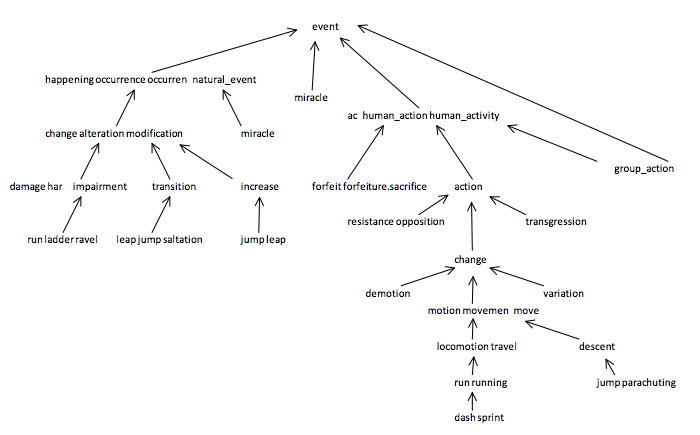
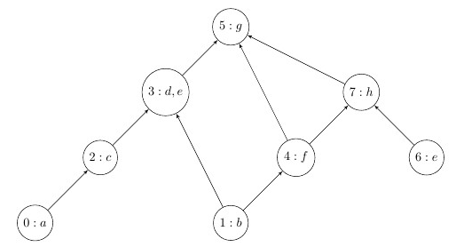

# Project 1: WordNet
Due: 14 September 2020, 11:59pm EDT (Late 15 September)

Points: 35 public, 35 semipublic, 30 secret

## Before You Start

If you have not yet completed [project 0](../project0), you should do so before starting this project.  At the very least, you should have everything related to Ruby installed correctly.  If you have any trouble with installation, check Piazza (or create a post if you don't find your problem there), or come to office hours to get help from a TA.

## Introduction

[WordNet](https://wordnet.princeton.edu/) is a semantic lexicon for the English language that is used extensively by computational linguists and cognitive scientists.  WordNet groups words into sets of synonyms called *synsets* and describes semantic relationships between them.  Relevant to this project is the *is-a* relationship, which connects a *hyponym* (more specific synset) to a *hypernym* (more general synset).  For example, a plant organ is a hypernym to plant root and plant root is a hypernym to carrot.

### Testing & Submitting

You will submit this project to [Gradescope](https://www.gradescope.com/courses/171498/assignments/624434).  You may only submit the **wordnet.rb** file.  To test locally, run `ruby test/public/public.rb`.

### Structure of WordNet Graph

In order to perform operations on WordNet, you will construct your own representation of hypernym relationships using the provided graph implementation ([graph.rb](src/graph.rb)).  Each vertex `v` is a non-negative integer representing a synset id, and each directed edge `v -> w` represents `w` as a hypernym of `v`.  The graph is directed and acyclic (DAG), though not necessarily a tree since each synset can have several hypernyms.  A small subset of the WordNet graph is illustrated below:



## Input File Formats

The WordNet is represented by two files which must each be formed as described below in order to be valid.  A major part of this project will be to process and load data from these supplied input files.

### Synsets File

The synsets file is a list of all of the synsets in WordNet (i.e. the vertices of the graph above).  A synset is a list of nouns that share the same meaning.  Each line of a valid synsets file consists of two fields:

- **Synset ID**: A unique, non-negative integer identifying the synset.
- **Synset**: A comma-delimited list of one or more nouns that belong to the synset.  Nouns are made up of letters (uppercase and lowercase), numbers, underscores, dashes, periods, apostrophes, and forward slashes.  These criteria will always define valid nouns wherever valid nouns are referenced in this document.

For example:
```text
id: 37559 synset: discussion,give-and-take
id: 50266 synset: news,intelligence,tidings
id: 60429 synset: parole,word_of_honor
id: 60430 synset: password,watchword,parole,countersign
```
A vaild synset file must follow exactly same structure as above, down to the spacing.

**Note**: A noun can appear in more than one synset.  A noun will appear once for each meaning of the word.  For example, all of the following synsets contain the noun "word", but with different meanings:

```text
id: 37559 synset: discussion,give-and-take,word
id: 50266 synset: news,intelligence,tidings,word
id: 60429 synset: parole,word,word_of_honor
id: 60430 synset: password,watchword,word,parole,countersign
```

Synset IDs may not be re-defined.  Thus, the second line in the following example is invalid:

```text
id: 29 synset: hello
id: 29 synset: goodbye
```

This also applies across multiple files: if two files are loaded which both contain the same ID, the second load should be counted as invalid.

### Hypernyms File

The hypernyms file contains the hypernym relationships between synsets.  Each line of a valid hypernyms file contains two fields:

- **Synset ID**: A non-negative integer identifying the synset these edges originate from.
- **Hypernym IDs**: A comma-delimited list of one or more non-negative integers representing synsets that edges will go to.

Each line of the file represents a set of edges from a synset to its hypernyms.  For example, the line
```text
from: 171 to: 22798,57458
```
means that the synset 171 ("Actified") has 2 hypernyms: 22798 ("antihistamine") and 57458 ("nasal_decongestant"), meaning that Actified is both an antihistamine and a nasal decongestant.  The synsets are obtained from lines in the synsets file with the corresponding synset IDs.

**Note**: A synset's hypernyms are not restricted to being listed on a single line.  They may be split among multiple lines. For example, the hypernyms from the example above may also be represented as follows:

```text
from: 171 to: 22798
from: 171 to: 57458
```

## A Note on Types

Ruby has no built-in way to restrict the types passed to methods.  As such, all method types specified in this document are the only ones you need to handle.  You may assume that no arguments will be passed outside of the types we specify, and your program may do anything in cases where improperly typed arguments are passed.  This is undefined behavior for this program and **will not be tested**.

The expected types will be represented in the following format at the beginning of each section:

```ruby
(String) -> Array or nil
```

This example describes a method that takes a single `String` as an argument and either returns an `Array` or `nil`, meaning that you may assume that a `String` will be passed in and you are responsible for ensuring that only an `Array` or `nil` is returned.  This also means that a subclass of `String` could be passed in or that a subclass of `Array` could be returned.

**Note**: Some shorthand is used to avoid verbosity in type siguatures; namely:
- `Integer` is used to refer to the union of `Fixnum` and `Bignum`.
- `Bool` is used to refer to the union of `TrueClass` and `FalseClass`.
- `nil` is used to refer to `NilClass`.

## Part 1: Synsets

The first part of this project consists of parsing from the synset file and implementing operations that pertain to single synsets. Information on the valid file format can be found above. The methods described below will be implemented in the `Synsets` class in [wordnet.rb](src/wordnet.rb).

#### `addSet(synset_id, nouns)`

- **Type**: `(Integer, Array) -> Bool`
- **Description**: Given a non-negative synset ID and an array of nouns in the synset, add this synset to the object.  If the synset ID is negative, or the list of nouns is empty, or the synset ID has already been defined, return `false` without modifying the current object.  Otherwise return `true` and store the new synset.
- **Examples**:
  ```ruby
  s = Synsets.new
  s.addSet(21, ["a"]) # returns `true`
  s.addSet(21, ["b"]) # returns `false`
  s.addSet(35, [])    # returns `false`
  s.addSet(-3, ["c"]) # returns `false`
  ```

#### `load(synsets_file)`

- **Type**: `(String) -> Array or nil`
- **Description**: Given the path to a synset file, validate the file and if it is valid, store its contents in the object and return `nil`.  You may store the synsets however you want, but a [`Hash`](https://ruby-doc.org/core-2.7.1/Hash.html) could be useful.  If any line is invalid (according to the rules in the [file format section](#Synsets-File)), the object's state should not be changed, and an `Array` of invalid line numbers (indexed from 1) should be returned in ascending order.  Remember that duplicate IDs, whether in the same file or different files, are invalid and should be included in this array of line numbers.  This function may be called multiple times, and successive loads should append any existing data.
- **Assumptions**: Assume that the file exists and is readable.
- **Examples**:
  ```ruby
  s1 = Synsets.new
  s1.load("public_synsets_valid")   # returns `nil`

  s2 = Synsets.new
  s2.load("public_synsets_invalid") # returns [2, 6, 7]
  ```

#### `lookup(synset_id)`

- **Type**: `(Integer) -> Array`
- **Description**: Given a synset ID, return an array of the nouns in the synset.  If there is no entry for the requested ID, return an empty array.
- **Examples**:
  ```ruby
  s = Synsets.new
  s.addSet(1, ["a", "b"])
  s.lookup(1)             # returns ["a", "b"]
  s.lookup(3)             # returns []
  ```

#### `findSynsets(to_find)`

- **Type**: `(Object) -> Array or Hash or nil`
- **Description**: This function behaves differently based on the type of the argument given.
    - If a `String` is provided, this method should return an array of 0 or more synset IDs corresponding to synsets containing this noun.
    - If an `Array` is provided (you can assume it is an Array of Strings), this method should return a hash where each key is a single noun from the given array, and each value is an array of synset IDs corresponding to synsets containing the noun.  This is similar to when a `String` argument is provided, but allows for batch processing.
    - If anything else is given, simply return `nil`.
- **Examples**:
  ```ruby
  s = Synsets.new
  s.addSet(1, ["a", "b"])
  s.addSet(2, ["a", "c"])
  s.addSet(3, ["c"])
  s.findSynsets("a")             # returns [1, 2]
  s.findSynsets("d")             # returns []
  s.findSynsets(["a", "c", "d"]) # returns { "a" => [1, 2], "c" => [2, 3], "d" => [] }
  s.findSynsets(34)              # returns `nil`
  ```

## Part 2: Hypernyms

The second part of this project requires you to construct and operate on a graph representing the hypernym relationships among members of the WordNet.  The methods described below will be implemented in the `Hypernyms` class in [wordnet.rb](src/wordnet.rb).

#### `addHypernym(source, destination)`

- **Type**: `(Integer, Integer) -> Bool`
- **Description**: Given source and destination synset IDs, create a hypernym relationship where the destination is a hypernym of the source.  This method should return `false` if either supplied synset ID is negative, or if the source and destination are the same.  Otherwise, add the new relationship and return `true`.  If the relationship already exists, still return `true`.
- **Examples**:
  ```ruby
  h = Hypernyms.new
  h.addHypernym(0, 1)  # returns `true`
  h.addHypernym(1, 1)  # returns `false`
  h.addHypernym(2, -1) # returns `false`
  ```

#### `load(hypernyms_file)`

- **Type**: `(String) -> Array or nil`
- **Description**: Given the path to a hypernym file, validate the file and if it is valid, store its contents in an instance of the provided `Graph` class and return `nil`.  Although you are not responsible for writing the `Graph` class yourself, you are responsible for understanding how it works.  If any line is invalid (according to the rules in the [file format section](#Hypernyms-File)), the object's state should not be changed, and an `Array` of invalid line numbers (indexed from 1) should be returned in ascending order.  Duplicate edges are allowed, and should not be counted as invalid.  This function may be called multiple times, and successive loads should append any existing data.  If a load fails on a structure that has already been successfully loaded, the data should not be replaced or affected in any way.
- **Assumptions**: Assume that the file exists and is readable.
- **Examples**:
  ```ruby
  h1 = Hypernyms.new
  h1.load("public_hypernyms_valid")   # returns `nil`

  h2 = Hypernyms.new
  h2.load("public_hypernyms_invalid") # returns [1, 4, 7]
  ```

#### `lca(id1, id2)`

In this part, you will find the least common ancestors of two nouns. An ancestral path between two ids `v` and `w` in the graph is a directed path from `v` to a common ancestor `x`, together with a directed path from `w` to the same ancestor `x`. A shortest ancestral path, or *SAP*, between ID `v` and ID `w` is an ancestral path of minimum total length. The common ancestor that participates in the path is called the lowest common ancestor, or *LCA*, of v and w. In the graph below, one ancestral path between ids 4 and 6 is of length 3 with common ancestor 5 (4->5 and 6->7->5). However, the SAP between 4 and 6 is of length 2 with common ancestor 7 (4->7 and 6->7). This makes 7 the LCA of 4 and 6.


- **Type**: `(Integer, Integer) -> Array or nil`
- **Description**: Given two synset IDs `id1` and `id2`, find all synset IDs which are lowest common ancestors (LCAs) of `id1` and `id2`.  If either of the given IDs is not in the graph, return `nil`.  Otherwise, return the list of lowest common ancestors as an array (which may be empty if no LCA is found).
- **Examples**:
  ```ruby
  # Let h be the graph represented by the image above
  h.lca(4, 6) # returns [7]
  h.lca(9, 1) # returns nil
  ```

## Part 3: CommandParser

We have provided a simple frontend of WordNet for you (in [interactive.rb](src/interactive.rb)); however, we have not implemented the parser that recognizes commands and returns responses.  The frontend can be run with the command `ruby src/interactive.rb`.  You can modify this file for local debugging purposes, but Gradescope will run the tests using our version.  The method described below will be implemented in the `CommandParser` class in [wordnet.rb](src/wordnet.rb).

The WordNet environment tracks an instance of `Synsets` and `Hypernyms`, which are initialized in the `initialize` method of the `CommandParser` class.

#### `parse(command)`

- **Type**: `(String) -> Hash`
- **Description**: Given a `String` command, perform the action defined by the command and return an appropriate response.  Commands may contain arbitrary amounts of leading and/or trailing whitespace, and arguments may be separated by one or more whitespace characters.  If Given a `String` command, perform the action defined by the command and return an appropriate response.  Commands may contain arbitrary amounts of leading and/or trailing whitespace, and arguments may be separated by one or more whitespace characters.  Valid commands are `load`, `lookup`, `find`, `findmany`, and `lca` (behavior described below).  If any other command is given, return `{ recognized_command: :invalid }`.  Otherwise, follow the specific protocol for each command described in the next section.
- **Examples**:
  ```ruby
  parse("load public_synsets_valid public_hypernyms_valid")   # returns { recognized_command: :load, result: true }
  parse("load public_synsets_valid public_hypernyms_invalid") # returns { recognized_command: :load, result: false }
  parse("invalid a b")                                        # returns { recognized_command: :invalid }
  ```

The five allowed commands are described in detail now.  For each, you will return a Hash containing two keys, `:recognized_command` and `:result`.  The values for these keys are set based on the command.  For example, if the command is `load` and the result is `false`, you would return

```ruby
{
    recognized_command: :load,
    result: false
}
```

#### `load <synset_file> <hypernym_file>`

For this command, `:recognized_command` should be set to `:load`.

The `load` command takes two arguments, a synset filename and a hypernym filename.  File names may contain letters, numbers, underscores, forward slashes, dashes, and periods.  You must validate the filenames in this way when parsing the command.  If the command is malformed in any way (i.e. invalid filenames, too many or too few arguments), set `:result` to `:error`.

If the command string is valid, you must then load the synsets and hypernyms.  If either file's contents are invalid, neither the `Synsets` nor the `Hypernyms` objects should be modified, and `:result` should be set to `false`.  Additionally, if there are any synset IDs referenced in the hypernyms file which are not present in either the current `Synsets` object or the just-loaded synsets file, do not modify either object, and set `:result` to `false`.

If everything is valid, import the new data and set `:result` to `true`.

#### `lookup <synset_id>`

For this command, `:recognized_command` should be set to `:lookup`.

The `lookup` command takes one argument, a synset ID.  If the command is malformed in any way (i.e. invalid synset ID, too many or too few arguments), set `:result` to `:error`.  Otherwise, set `:result` to whatever is returned by calling `lookup(synset_id)` on the `Synsets` object of the current `CommandParser` object.

#### `find <noun>`

For this command, `:recognized_command` should be set to `:find`.

The `:result` should be set to whatever is returned by calling `findSynsets(noun)` on the `Synsets` object, where `noun` is passed as a `String`.  If the command is malformed in any way (i.e. invalid noun, too many or too few arguments), set `:result` to `:error`.

#### `findmany <noun1>[,<noun2>[,<noun3>[...]]]`

For this command, `:recognized_command` should be set to `:findmany`.

The `:result` should be set to whatever is returned by calling `findSynsets(nouns)` on the `Synsets` object, where `nouns` is passed as an `Array` of one or more nouns (the nouns given to this command).  If the command is malformed in any way (i.e. invalid noun(s), too many or too few arguments, or malformed list of nouns), set `:result` to `:error`.

#### `lca <id1> <id2>`

For this command, `:recognized_command` should be set to `:lca`.

If either `id1` or `id2` is invalid, or too many or too few arguments are supplied, set `:result` to `:error`.  Otherwise, `:result` should be set to the result of calling `lca(id1, id2)` on the `Synsets` object, where `id1` and `id2` are the ones given in the command.

### Example Interaction

An example interaction with the interactive shell should look like this:

```text
$ ruby src/interactive.rb
Wordnet interactive shell.
wordnet> load inputs/public_synsets_valid inputs/public_hypernyms_valid
Load succeeded
wordnet> lookup 3
Lookup result:
d
e
wordnet> find a
Find result:
0
wordnet> findmany b,a,d
Findmany result:
b: 1
a: 0
d: 3
wordnet> lca 1 2
Least common ancestor:
3
wordnet> invalid command
Error: Invalid command
wordnet> load these are bad arguments
Load: Error
wordnet> exit
Goodbye
```

## Academic Integrity

Please **carefully read** the academic honesty section of the course syllabus. **Any evidence** of impermissible cooperation on projects, use of disallowed materials or resources, or unauthorized use of computer accounts, **will be** submitted to the Student Honor Council, which could result in an XF for the course, or suspension or expulsion from the University. Be sure you understand what you are and what you are not permitted to do in regards to academic integrity when it comes to project assignments. These policies apply to all students, and the Student Honor Council does not consider lack of knowledge of the policies to be a defense for violating them. Full information is found in the course syllabus, which you should review before starting.
